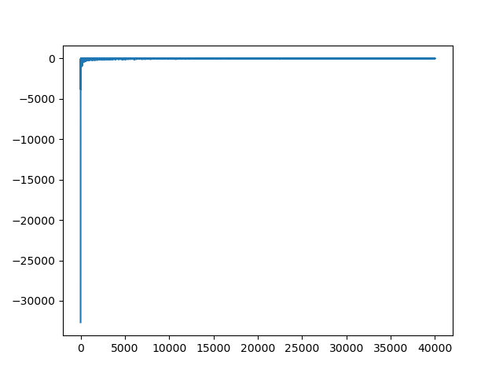

# reinforcement-learning
A collection of various reinforcement learning exercises inspired by Reinforcement Learning: An Introduction [(Link to Book)](http://incompleteideas.net/book/the-book.html) from Richard S. Sutton and Andrew G. Barto.

The files in this repository are self-contained - each can be analyzed and modified on its own. Feel free to play around!

## bandits.py

Implements a simple 10-armed-bandits szenario. The action values ai are taken from a normal distribution with mean 0 and variance 1 for each bandit; each reward is then sampled with mean 0 and variance 1.

Average reward:

Amount of times (in percent of total) the correct action was chosen:

## policy_iteration.py

Implements a one-dimensional gridworld with 10 states. The leftmost and rightmost states are terminal with rewards of +10 and -5 respectively. Estimates the state values under an equiprobable random policy and then improves it using value iteration.

## racetrack.py

Solves the racetrack environment using Q-learning.

###Racetrack 1:

Rewards per step:

Example policies for Racetrack 1:

###Racetrack 2:

Rewards Per Step:

Example policies for racetrack 2:

## windy_gridworld.py

Solves the windy-gridworld problem (featuring three sets of moves) using Q-learning.

## stochastic_windy_gridworld.py

Extend the standard windy-gridworld problem by a stochastic component and solves it using Q-learning.

## td_n.py

Implements a TD(n) method to solve a gridworld-with-obstacles example.

Example run:

## dynaq.py

Implements DynaQ to solve the gridworld-with-obstacles example.

Environment:

Runs with different amounts of planning steps:

## reinforce.py

Implements the standard reinforce algorithm to solve the [Cart-Pole](https://gym.openai.com/envs/CartPole-v0/) environment.

An example run with the parameters in the script:

## reinforce_with_baseline.py

Extend the standard reinforce implementation by a baseline to solve the [Cart-Pole](https://gym.openai.com/envs/CartPole-v0/) environment.

An example run with the parameters in the script (note the reduced variance by incorporating a baseline):

## reinforce_actor_critic.py

Uses the actor-critic implementation to solve the [Cart-Pole](https://gym.openai.com/envs/CartPole-v0/) environment.

Thanks to the online fashion of the actor-critic algorithm (repeated updates during the execution of an episode), we are able to solve the environment in just little over 20 steps (using a higher learning rate). However, the procedure suffers from high variance and thus also convergence issues. Below is an example run with the parameters from the script:

